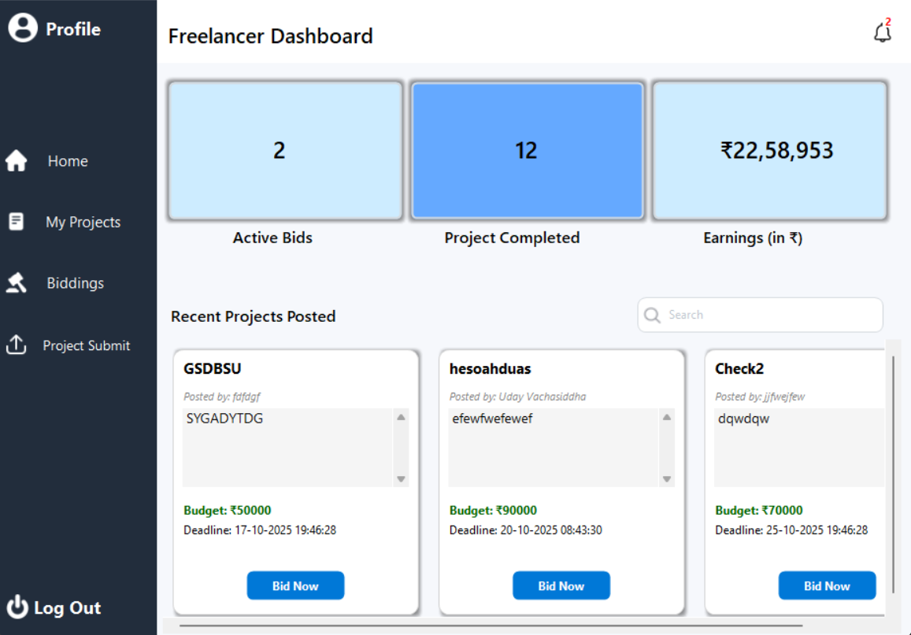
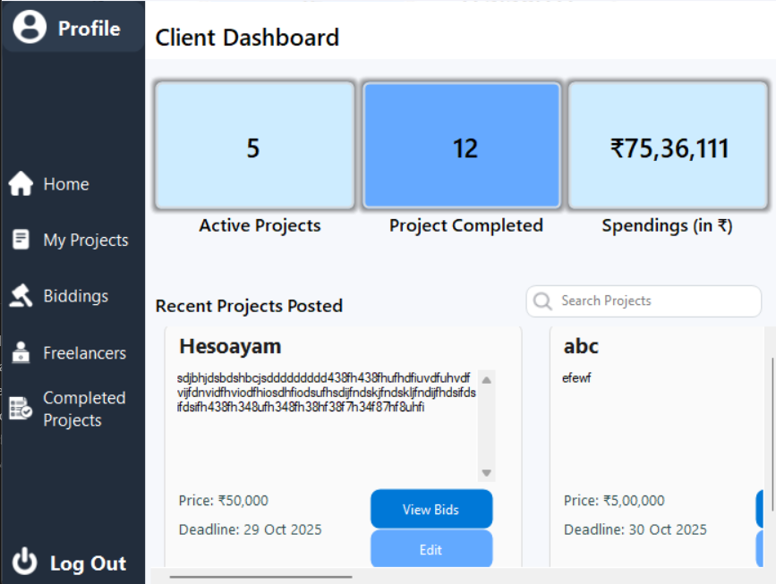

# FreeHive


**FreeHive** is a comprehensive desktop application built with C# and Windows Forms (.NET) that serves as a dynamic marketplace connecting clients with skilled freelancers. It provides a seamless platform for users to post projects, bid on jobs, manage tasks, and communicate securely.

---

## 🌟 Key Features

### For Clients
* **Client Dashboard:** A centralized hub to manage your projects, view active biddings, and track completed tasks.
* **Project Management:** Easily post new projects with requirements and budgets, and review submissions from freelancers.
* **Bidding System:** Review bids from various freelancers and select the best fit for your project.
* **Direct Messaging:** Communicate directly with freelancers to discuss project details.
* **Profile Management:** Set up and edit your client profile to build trust on the platform.

### For Freelancers
* **Freelancer Dashboard:** Browse available projects tailored to your skills.
* **Bidding & Proposals:** Submit competitive bids and proposals for projects you are interested in.
* **Project Submission:** Submit completed project files and updates directly through the app.
* **My Projects:** Track your active, pending, and completed projects in one place.
* **Profile Building:** Highlight your skills and experience through a customizable profile.

### Security & Authentication
* **Secure Login & Registration:** Robust user authentication system.
* **OTP Verification:** Integrated with Firebase for secure password recovery and account verification via OTP.

---

## 🛠️ Technologies Used

* **Language:** C#
* **Framework:** .NET Framework (Windows Forms)
* **Authentication & Services:** Firebase (OTP Verification)
* **IDE:** Visual Studio

---

## 🚀 Getting Started

### Prerequisites
* [Visual Studio](https://visualstudio.microsoft.com/) (2019 or later recommended)
* .NET Framework (version specified in `App.config`)
* An active internet connection for Firebase features

### Installation & Setup
1. **Clone the repository:**
   ```bash
   git clone https://github.com/yourusername/FreeHive.git
   ```
2. **Open the Project:**
   Locate and open the `Freelancer app.sln` file in Visual Studio.
3. **Restore NuGet Packages:**
   Ensure all dependencies in `packages.config` are restored. Visual Studio should do this automatically upon building the project, or you can right-click the solution and select "Restore NuGet Packages".
4. **Build and Run:**
   Press `F5` or click **Start** in Visual Studio to compile and run the application.

---

## 📸 Screenshots

- **Login Screen:**
  <br>

- **Freelancer Dashboard:**
  <br>

- **Client Dashboard:**
  <br>

---

## 🤝 Contributing

Contributions, issues, and feature requests are welcome! 
If you would like to contribute, please fork the repository and create a pull request with your changes.

1. Fork the Project
2. Create your Feature Branch (`git checkout -b feature/AmazingFeature`)
3. Commit your Changes (`git commit -m 'Add some AmazingFeature'`)
4. Push to the Branch (`git push origin feature/AmazingFeature`)
5. Open a Pull Request

---

## 📄 License

This project is open-source. Please see the `LICENSE` file for more details.

---
*Created with ❤️ by the FreeHive Team.*
